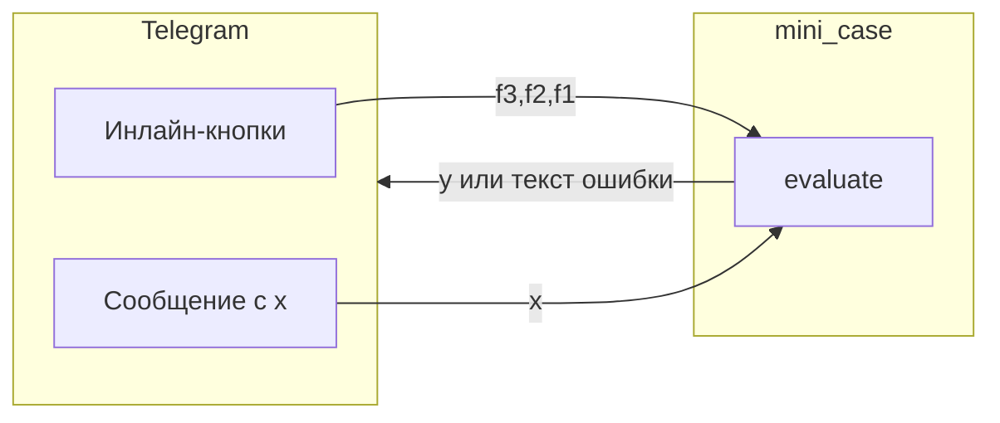

# Архитектура и ход выполнения

## Общая схема

Пользователь **не пишет код**: он задаёт **тройку функций** и **число x**. Ядро возвращает либо **y**, либо структурированную ошибку области определения.

## Пакет `mini_case`

- **`evaluate.py`** — единственная точка бизнес-логики:
  - `_apply_sqrt`, `_apply_inv`, `_apply_exp` — вычисление одного шага и проверка ОДЗ;
  - `evaluate` — цикл из трёх шагов, возврат `EvalOk` или `EvalErr`;
  - `format_chain_readable` — строка вида `y = √x(1/x(e^x(x)))` для отображения (читаемые имена функций).

Зависимостей от Telegram **нет** — ядро можно вызывать из тестов или другого интерфейса.

## Пакет `bot`

- **`main.py`** — загрузка `.env`, создание `Bot`/`Dispatcher`, `MemoryStorage`, `start_polling`.
- **`states.py`** — FSM: выбор F₃, F₂, F₁, ожидание **x**.
- **`keyboards.py`** — разметка инлайн-кнопок и разбор `callback_data`.
- **`handlers.py`** — сценарии:
  - `/start` — меню;
  - `Собрать цепочку` — переход к выбору F₃;
  - колбэки `f3:*`, `f2:*`, `f1:*` — запись выбора и переход к следующему шагу;
  - после F₁ — запрос **x** текстом;
  - в состоянии ожидания **x** — вызов `evaluate` и ответ;
  - `Пересобрать цепочку` — сброс и снова шаг F₃;
  - `Справка` и `/help` — текст с описанием модели и кнопок.

## Кнопки (для отчёта)

| Кнопка / команда | Действие |
|------------------|----------|
| **Собрать цепочку F₃ → F₂ → F₁** | Начать пошаговый выбор трёх функций. |
| **√x / 1/x / e^x** (на шагах 1–3) | Назначить функцию на позицию F₃, F₂ или F₁. |
| **Пересобрать цепочку** | Очистить FSM и снова предложить выбор F₃. |
| **Справка** | Показать описание модели, ОДЗ и кнопок. |
| Сообщение пользователя с числом | В состоянии ожидания **x** — вычислить **y** или показать ошибку ОДЗ. |
| `/start` | Сброс состояния и главное меню. |
| `/help` | Текст справки. |

## Ограничения

- **MemoryStorage**: состояние диалога хранится в памяти процесса — после перезапуска бота сессии сбрасываются.
- Число **x** парсится из текста (поддерживается запятая как десятичный разделитель).
